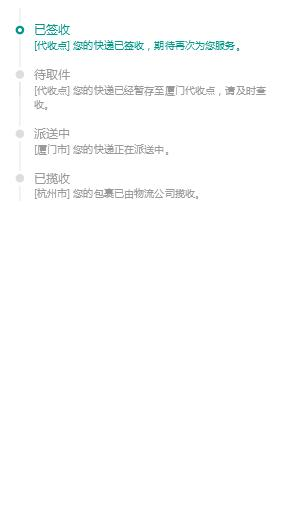
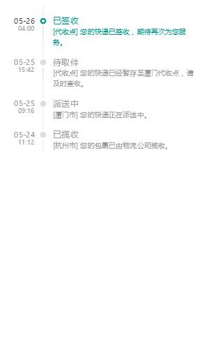

# 功能描述
时间轴UI，可用于物流显示,用例见 index.html。

# 效果图



# 依赖的模块
./libs/index.css


# 快速使用
```
 <div class="list">

    <div class="item-inner flex-box-x active">
        <div class="item-date">
            <div class="date">05-26</div>
            <div class="time">04:00</div>
        </div>

        <div class="dot"><i></i></div>
        <div class="item-main col-xs-x">
            <div class="item-type">已签收</div>
            <div class="item-content">[代收点] 您的快递已签收，期待再次为您服务。</div>
        </div>
    </div>

    <div class="item-inner flex-box-x">
        <div class="item-date">
            <div class="date">05-25</div>
            <div class="time">15:42</div>
        </div>

        <div class="dot"><i></i></div>
        <div class="item-main col-xs-x">
            <div class="item-type">待取件</div>
            <div class="item-content">[代收点] 您的快递已经暂存至厦门代收点，请及时查收。</div>
        </div>
    </div>
    ......
</div>
```

# 特别说明
样式修改，见用例 index.html。
